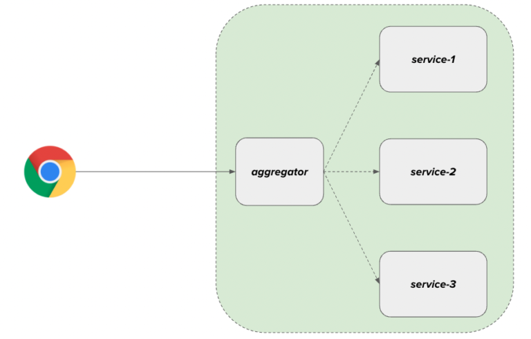

# Spring WebFlux Aggregation

## Overview:

Let’s develop a simple application to demonstrate **Spring WebFlux Aggregation** (aka **Gateway Aggregation**) to send requests to multiple Microservices and gather responses from them to aggregate into a single response.

## Spring WebFlux Aggregation:

In a Microservice architecture, we will have N number of services and each service has its own responsibilities & databases. Data would have been distributed among them. For ex:

    1. user-service: It is responsible for all the user management.
    2. order-service: It is responsible for managing customer’s orders.

Let’s say we have a requirement in which user profile page should show user information along with user’s orders. To do this, the client/frontend might have to call these 2 microservices to build the page. If you have something like a dashboard page, the frontend might have to call multiple microservices. Usually it is NOT a preferred approach to let the frontend to make multiple calls. Instead we could have another microservice which acts like an **aggregator** whose main responsibility is to receive the request from the frontend and gather all the  required information from multiple microservices, build the combined response and send it to the frontend as shown here.



## Advantages:

    1. Reduced network calls & latency
    2. Aggregator acts like a facade & hides the backend complexity.

**Advantages Spring WebFlux** & **Advantages Spring WebClient** would be a perfect choice here to build this aggregator service for making these calls in a non-blocking way to utilize the system resources efficiently.

# Sample Application:

We are going to build a sample application in which the frontend requires a complete product information.

    1. product details
    2. promotion details
    3. reviews / customer feedbacks.

Let’s assume that these are all being managed by 3 different microservices. So we need an aggregator to receive the request and build the response.

## Project Setup:

    1. Create a spring application with the following dependencies:

        * spring-boot-starter-webflux
        * spring-boot-starter-actuator
        * Lombock

    2. We are going to mock the above 3 microservices by using json-server.
    3. Create a file called db.json which will act like a database.
    4. product-service: Add this product information:

    ```json
        "products": [
            {
                "id":1,
                "description":"iphone",
                "category": "electronics"
            },
            {
                "id":2,
                "description":"air-fryer",
                "category": "kitchen"
            },
            {
                "id":3,
                "description":"calming pet bed",
                "category": "pet supplies"
            }
        ]
    ```
    5. promotion-service: Add this promotion information:

    ```json
        "promotions":[
            {
                "id":1,
                "type":"christmas sale",
                "discount": 12.0,
                "endDate": "2022-12-26"
            },
            {
                "id":3,
                "type":"new year sale",
                "discount": 6.0,
                "endDate": "2022-12-31"
            }
        ]
    ```
    6. ratings-service: Add this ratings information:

    ```json
        "reviews":[
            {
                "productId": 1,
                "user": "sam",
                "rating": 4,
                "comment": "it is good"
            },
            {
                "productId": 2,
                "user": "jake",
                "rating": 2,
                "comment": "stopped working after 2 weeks :("
            }
        ]
    ```

    7. We can use the below docker-compose yaml to expose REST APIs to access above information.

    ```yaml
        version: '3'
        services:
        server:
            image: clue/json-server
            ports:
            - "3000:80"
            volumes:
            - ${PWD}/db.json:/data/db.json
    ```

    8. For example, sending below requests to show the corresponding data.

    ```bash
        # shows the product 1 information
        curl http://localhost:3000/products/1

        # shows the promotion details for product id = 1
        curl http://localhost:3000/promotions/1

        # to get all the reviews for product id = 1
        curl http://localhost:3000/reviews?productId=1
    ```
Now we have created 3 microservices using json-server. It is time for us to build the **Spring WebFlux Aggregation** Service.

## Spring WebFlux Aggregation Service:

This microservice is responsible for talking to those 3 services to gather the product, promotion and reviews information and respond with a combined response as shown here.

    * Product Aggregator Dto:

    ```java
        @Data
        @ToString
        @AllArgsConstructor(staticName = "create")
        public class ProductAggregate {
            private Product product;
            private Promotion promotion;
            private List<Review> reviews;
        }
    ```

    * Product Dto:

    ```java
        @Data
        @ToString
        public class Product {
            private String id;
            private String description;
            private String category;
        }
    ```

    * Promotion Dto:

    ```java
        @Data
        @ToString
        public class Promotion {
            private String type;
            private Double discount;
            private LocalDate endDate;
        }
    ```

    * Review Dto:

    ```java
        @Data
        @ToString
        public class Review {
            private String user;
            private Integer rating;
            private String comment;
        }
    ```

## WebClient:

This service needs to call 3 different microservices. So we are going to build a client to make calls in this aggregator service. Do note that this service should be highly resilient. That is, when we have product and promotion information but the review-service is not available, we should not fail the request. Instead we could still build the response assuming there are no reviews for the product as a fallback in case of error. Check the implementation here to get an idea.

    * product-client:

    ```java
        @Service
        public class ProductClient {

            private final WebClient client;

            public ProductClient(WebClient.Builder builder) {
                this.client = builder.baseUrl("http://localhost:3000/products/").build();
            }

            public Mono<Product> getProduct(Integer productId){
                return this.client
                        .get()
                        .uri("{productId}", productId)
                        .retrieve()
                        .bodyToMono(Product.class)
                        .onErrorResume(ex -> Mono.empty()); // switch it to empty in case of error
            }
        }
    ```

    * promotion-client:

    ```java
        @Service
        public class PromotionClient {

            private final WebClient client;
            private final Promotion noPromotion = new Promotion("no-promotion", 0.0, LocalDate.of(2999, 12, 31));

            public PromotionClient(WebClient.Builder builder) {
                this.client = builder.baseUrl("http://localhost:3000/promotions/").build();
            }

            public Mono<Promotion> getPromotion(Integer productId){
                return this.client
                        .get()
                        .uri("{productId}", productId)
                        .retrieve()
                        .bodyToMono(Promotion.class)
                        .onErrorReturn(noPromotion); // if no result, it returns 404, so switch to no promotion
            }
        }    
    ```

    * review-client:

    ```java
        @Service
        public class ReviewClient {

            private final WebClient client;

            public ReviewClient(WebClient.Builder builder) {
                this.client = builder.baseUrl("http://localhost:3000/reviews").build();
            }

            public Mono<List<Review>> getReviews(Integer productId){
                return this.client
                        .get()
                        .uri(b -> b.queryParam("productId", productId).build())
                        .retrieve()
                        .bodyToFlux(Review.class)
                        .collectList()
                        .onErrorReturn(Collections.emptyList()); // in case of error, switch it to empty list
            }
        }
    ```

## Gateway Aggregator Service:

This is the service class which combines the information and builds the response. Use **Mono.zip** to make these calls in an asynchronous and non-blocking fashion and combine the responses in a **Tuple** object.

    ```java
        @Service
        @AllArgsConstructor
        public class ProductAggregatorService {

            private final ProductClient productClient;
            private final PromotionClient promotionClient;
            private final ReviewClient reviewClient;

            public Mono<ProductAggregate> getProduct(Integer productId){
                return Mono.zip(
                        this.productClient.getProduct(productId),
                        this.promotionClient.getPromotion(productId),
                        this.reviewClient.getReviews(productId)
                )
                .map(this::combine);
            }

            private ProductAggregate combine(Tuple3<Product, Promotion, List<Review>> tuple){
                return ProductAggregate.create(
                        tuple.getT1(),
                        tuple.getT2(),
                        tuple.getT3()
                );
            }
        }
    ```

    * Finaly the Controller:

    ```java
        @RestController
        @RequestMapping("product")
        public class ProductAggregateController {

            @Autowired
            private ProductAggregatorService service;

            @GetMapping("{productId}")
            public Mono<ResponseEntity<ProductAggregate>> getProduct(@PathVariable Integer productId){
                return this.service.getProduct(productId)
                        .map(ResponseEntity::ok)
                        .defaultIfEmpty(ResponseEntity.notFound().build());
            }
        }    
    ```

That’s it!

# Spring WebFlux Aggregation – Demo:

    1. Start our aggregator application. Send the below request.

    ```bash
        # get combined product information for id = 2
        curl http://localhost:8080/product/2
    ```

    2. We could see below response:

    ```json
        {
            "product":{
                "id":"2",
                "description":"air-fryer",
                "category":"kitchen"
            },
            "promotion":{
                "type":"no-promotion",
                "discount":0.0,
                "endDate":"2999-12-31"
            },
            "reviews":[
                {
                    "user":"jake",
                    "rating":2,
                    "comment":"stopped working after 2 weeks :("
                },
                {
                    "user":"dre",
                    "rating":3,
                    "comment":"good so far"
                }
            ]
        }
    ```

## Resilience:

We have also made our service resilient. For ex: in the reviews-client, change the port from 3000 to 4000. Restart the the application and send this request:

```bash
    curl http://localhost:8080/product/2
```

We see this response. Even if the review-service is not reachable at port 4000, our application still works with default response.

```json
{
   "product":{
      "id":"1",
      "description":"iphone",
      "category":"electronics"
   },
   "promotion":{
      "type":"christmas sale",
      "discount":12.0,
      "endDate":"2022-12-26"
   },
   "reviews":[
      
   ]
}
```

## Summary:

We were able to successfully demonstrate Spring WebFlux Aggregation to gather responses from multiple microservices to build a combined response for the client application. We also saw how to make them more resilient.
